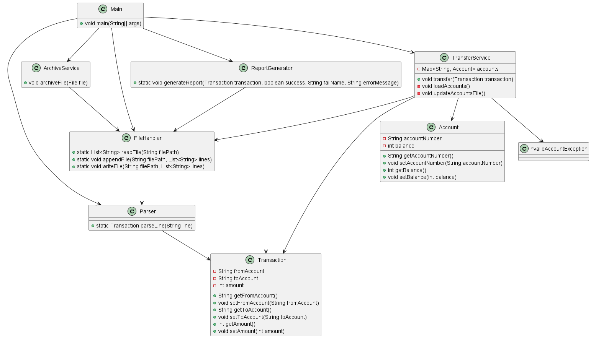

# Money Transfers

## Description
This project is designed for transferring money from one account to another. The main functions include the transfer of money itself, saving transaction information to a report file, and updating accounts after all transactions.

## Installation
The project requires IntelliJ IDEA for development and execution.

## Usage
The project can be used for bank transfers. To change the input data, you need to modify the data in the files in the "input" directory. Do not change the structure of the lines in the file! Line structure: XXXXX-XXXXX|YYYYY-YYYYY|XXX, where XXXXX-XXXXX is the sender's account number, YYYYY-YYYYY is the recipient's account number, and XXX is the transfer amount.

## Running the Project
To run the project, you need to go to the main method -> run the program -> select the operation.

## Testing
To run tests in the project, you can use the following command:

The project has a TransactionTest class that contains tests for checking the correctness of transaction operations. These tests check various aspects of working with transactions, such as parsing transactions and handling invalid values.

Class Diagram
Below is the class diagram of the project:

Contributing

If you want to contribute to this project, please first discuss the changes you want to make through an issue.

License

The project is distributed without a license. Please use it at your discretion.

Contact

If you have any questions or suggestions related to this project, you can contact me:

Phone: +375441111111

GitHub Profile: AlexanderTarasevich

LinkedIn Profile: Alexander Tarasevich